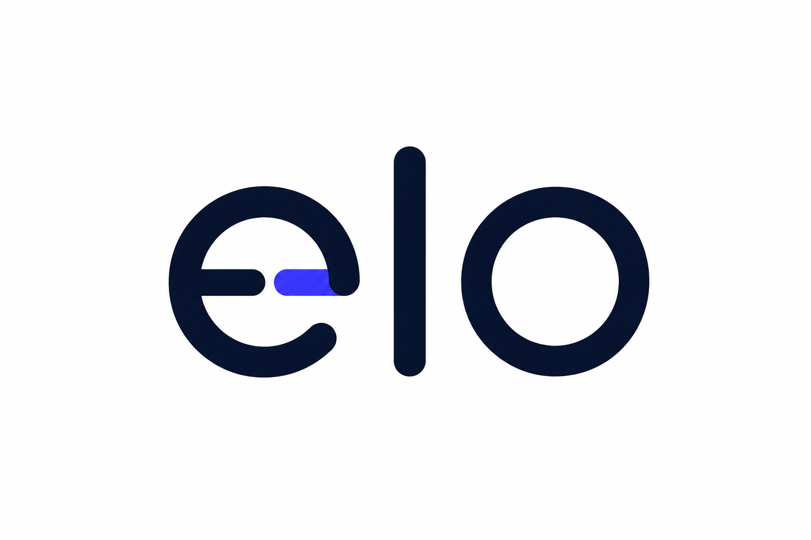

🇵🇹 Português | 🇬🇧 [English](README.md)

<p align="center">
  <picture>
    <source media="(prefers-color-scheme: dark)" srcset=".github/assets/logo-dark.png">
    <source media="(prefers-color-scheme: light)" srcset=".github/assets/logo-light.png">
    
  </picture>
</p>

<p align="center">
  <strong>Pára de construir o mesmo painel de administração em cada website.</strong>
</p>

<p align="center">
  <a href="PROGRESS.pt.md">Acompanha o desenvolvimento</a> ·
  <a href="docs/adr">Lê a arquitectura</a> ·
  <a href="#instalação">Instalação</a>
</p>

<p align="center">
  
  
  
  
</p>

---

## O problema

Todos os websites Laravel que entregas precisam das mesmas coisas: login,
dashboard, CRUD de páginas e conteúdo, formulários, uploads, campos de SEO,
menus. Já construíste isto antes. Vais construir outra vez no próximo
projecto, do zero, porque qualquer gerador de painel administrativo ou te
prende à interface de outra pessoa, ou dá-te CRUD genérico que não encaixa
na forma como o site do teu cliente realmente pensa o seu conteúdo.

**O Elo não é mais um gerador de CRUD.** Descreves o domínio do teu site em
PHP simples, usando sete conceitos, `Module`, `Resource`, `Blueprint`,
`Field`, `Layout`, `Action`, `Repository`, e o Elo constrói a interface de
gestão, a API, e as migrations da base de dados à volta disso. O teu CSS.
A tua aplicação Laravel. Sem caixa preta.

```php
class PostResource extends Resource
{
    public function blueprint(): Blueprint
    {
        return Blueprint::make()
            ->fields([
                Text::make('title')->required(),
                RichText::make('body'),
                Image::make('cover'),
            ])
            ->layout([
                Section::make('content')->fields(['title', 'body']),
            ]);
    }
}
```

Isto é um ecrã de CRUD completo, validação, e (em breve) uma migration
gerada automaticamente, a partir de umas dez linhas que são realmente tuas.

## Porque é diferente

| | Painel administrativo genérico | Page builder / estilo WordPress | **Elo** |
|---|---|---|---|
| Framework de UI | Prende-te ao deles | Prende-te ao deles | O teu próprio CSS, Livewire simples |
| O que gere | Qualquer model, de forma genérica | Layout visual de página | O domínio real do teu site, declarado em PHP |
| Onde vive | Produto à parte | Plataforma à parte | Um pacote Composer, um por projecto |
| Como se estende | Plugins, se suportado | Ecossistema de temas/plugins | Compor Blueprints, distribuir módulos como pacotes Composer |
| Via de escape | Muitas vezes nenhuma | Raramente | Cada camada é um binding do Laravel substituível |

O Elo não tenta substituir o Laravel, nem tornar-se um CMS. É a peça que
falta entre "descrevi o meu domínio" e "existe um painel de administração a
funcionar para ele", nem mais, nem menos. Ver [o que o Elo é, e o que não é](docs/adr/pt/ADR-002-elo-filosofia.md)
para o limite completo.

## Instalação

```bash
composer require ecnmee/elo
```

*(Pacote em desenvolvimento activo, ainda não publicado no Packagist, ver
[PROGRESS.pt.md](PROGRESS.pt.md) para saber exactamente a que distância está.)*

## Construído em aberto, arquitectura primeiro

Antes de escrever qualquer código de implementação, a arquitectura completa
foi trabalhada e congelada em três ADRs públicas, hierarquia e contratos,
filosofia e limites, vocabulário oficial, todas em [`docs/adr/`](docs/adr).
Cada classe do core vem com testes que validam o contrato público, e o CI
falha automaticamente se o core alguma vez passar a depender de um módulo
de terceiros específico. Se quiseres ver o raciocínio por trás de cada
decisão, não só o resultado, está tudo ali para leres.

## Guia do utilizador

Documentação do que existe de facto hoje, a crescer a cada passo real de
implementação, sem tutoriais para funcionalidades que ainda não existem:
ver [`docs/guide/`](docs/guide/pt/introducao.md).

## Progresso do desenvolvimento

Estás a acompanhar? Ver [PROGRESS.pt.md](PROGRESS.pt.md) para um registo em
linguagem simples, actualizado regularmente, do ponto em que o projecto
está, sem precisares de ler cada commit.

## Contribuir

Ver [CONTRIBUTING.md](CONTRIBUTING.pt.md) para saber como reportar problemas
e pedir funcionalidades.

## Código de conduta

Ver [CODE_OF_CONDUCT.md](CODE_OF_CONDUCT.pt.md).

## Licença

MIT, ver [LICENSE](LICENSE).

---

<p align="center">
  Se esta abordagem a painéis de administração faz sentido para ti, uma star ajuda mais gente a encontrar o projecto enquanto ainda está a ser construído.
</p>
